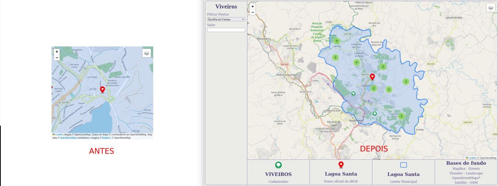

# Main webmaps

Aqui vou dar continuidade nas melhorias do webmap.

## Usando extensão .js nos arquivos GeoJSON

Estava procurando uma forma de melhorar o [`index.js`](./index.js) e tentar utilizar menos promisses.

Uns amigos me deram uma idéia de se olhar o código gerado pelo plugin [`qgis2web`](https://github.com/tomchadwin/qgis2web) e uma das coisas que ví é que utilizam arquivos .js ([JavaScript](https://www.javascript.com)) no lugar de arquivo .geojson ([GeoJSON](https://geojson.org)) mas mantendo a estrutura do arquivo em uma variável.

Os arquivos precisam ser inseridos no [`index.html`](./index.html) usando a tag `script` antes do script principal, assim os dados são carregados antes do arquivo que irá precisar deles.

## Usando onEachFeature

Essa é uma opção bacana que tem no `L.geoJSON`, é uma função que recebe dois argumentos `feature` e `layer`.

O parametro `feature` recebe os dados completos da feição em si, e `layer` recebe a camada gerada.

Assim podemos aplicar o `bindPopup` ou outros tratamentos que quisermos em todas as feições da camada após a sua criação e estilização.

Documentação [`clique aqui`](https://leafletjs.com/reference.html#geojson-oneachfeature).

## Filtrando o GeoJSON

Essa opção recebe uma função que vai decidir se a feição deve ser aplicada ou não.  
Recebe a feição como parâmetro, e dentro dela devem ser feitos os devidos tratamentos.

Documentação [`clique aqui`](https://leafletjs.com/reference.html#geojson-filter).

## Novos Componentes

Foram adicionados vários componentes HTML à página pra poder dar um visual diferente e possibilidade de fazer os filtros na tela.

### DIV filter container

É um container que irá receber todas as opções de filtros de dados, e irá mostrar também o nome da página/tela/aplicação que estamos montando.

Irá funcionar como um side menu

### DIV map items container

Este container recebe os itens básicos do mapa que são:

- `map` Que recebe o map do leaflet.
- `legend container` Que recebe alguns itens que serão a legenda do mapa.

## Estilo

O estilo da página foi feito usando uma combinação de `flexbox` ([veja esse artigo da alura sobre](https://www.alura.com.br/artigos/css-guia-do-flexbox?gclid=CjwKCAjwsfuYBhAZEiwA5a6CDJVEuQ0ohOQ1kMDKVKymp2ZDQHbyyw-KEddMDcpFsjd8Sov3luRIahoCda4QAvD_BwE)) na maioria dos componentes e `grid` que é usado apenas no `legend container` para facilitar a criação de colunas com o mesmo tamanho.

## Fontes

[Digital Geography](https://digital-geography.com/filter-leaflet-maps-slider/)
